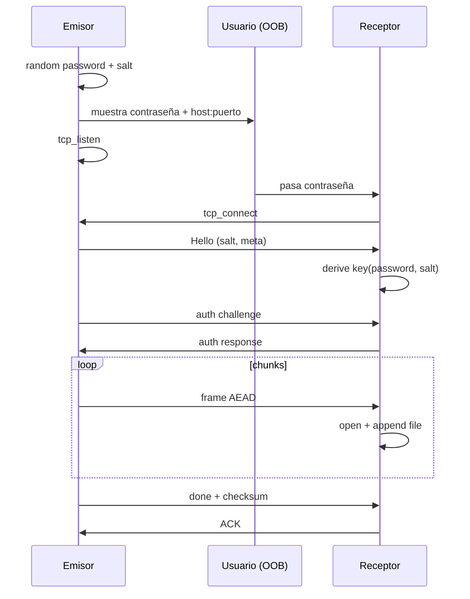

# Plan: takeit — transferencia de archivos E2E en Raylang

## Objetivo

CLI peer-to-peer: un equipo **envía** un archivo y otro **recibe** con la misma app. El canal va cifrado de extremo a extremo; al enviar se genera una **contraseña aleatoria** que el receptor debe introducir (fuera de banda: chat, voz, etc.).

## Decisiones v1 (por defecto)

| Decisión | Elección |
|----------|----------|
| Quién escucha | Emisor (`send` hace `tcp_listen`) |
| Contraseña | 8 bytes CSPRNG → hex agrupado `xxxx-xxxx-xxxx-xxxx` |
| Chunk | 256 KiB |
| Alcance | P2P directo (sin relay/NAT traversal) |
| I/O | Streaming: `fs.read_bytes`/`fs.seek` (M113) vía `fileread`; escritura con `append_file_bytes` + rename atómico |
| Integridad | Hash encadenado `sha256(state ‖ sha256(chunk))` (sin cargar el archivo entero) |
| Transporte | TCP crudo + AEAD de aplicación (TLS opcional más adelante) |

## Base técnica (stdlib / MCP)

| Pieza | API Raylang |
|--------|-------------|
| CSPRNG / secretos | `crypto.random_bytes` (no `std/random`) |
| AEAD | `crypto.chacha20poly1305_seal/open` (key 32 B, nonce 12 B) |
| Derivación | `crypto.hmac_sha256` + `crypto.sha256` (KDF propio; no hay HKDF/PBKDF nativo) |
| Archivos | `fs.read_file_bytes` / `fs.write_file_bytes` |
| Red | `net.tcp_listen` / `tcp_accept` / `tcp_connect` + `socket_*_bytes` |
| CLI | `args()` |
| Feedback agente | MCP `ray mcp`: `ray_check`, `ray_run`, `ray_test`, `ray_fmt`, `ray_doc` + `raylang://llms.txt` |

Nota: `socket_read_bytes` lee **un trozo**; hace falta framing por longitud + buffer de sobrante.

## UX

```text
# Emisor
takeit send ./informe.pdf
→ Contraseña: 7k9m-qp2x-lw4n-ab01
→ Esperando en 0.0.0.0:7421 …

# Receptor
takeit recv --host 203.0.113.10 --port 7421 --password 7k9m-qp2x-lw4n-ab01
→ Guardado: ./informe.pdf
```

Opciones: `--port`, `--bind`, `--out`, `--password`, `--timeout SECS` (default 120; idle en accept/lectura).

Durante la transferencia, stderr muestra progreso (`enviando`/`recibiendo` con %, velocidad y ETA).

## Modelo de amenaza y cifrado

1. **Contraseña fuera de banda** — único secreto compartido.
2. **Salt público** (16 B) en el handshake en claro.
3. **KDF v1**: `key = hmac_sha256(sha256(password_utf8), salt ‖ "takeit-v1")`.
4. **Payload**: chunks AEAD; nonce = `contador u64 BE ‖ 4 ceros` (12 B); AAD = índice + nombre + tamaño.
5. **Integridad**: fallo de `open` → abortar (tampering / contraseña mala).
6. **TLS** (futuro): no sustituye el E2E por contraseña.

## Protocolo (sobre TCP)

Frames: `u32 BE length` + payload.

| Fase | Contenido |
|------|-----------|
| 1. Hello (claro) | magic `TAKE`, versión, salt, nombre, tamaño, chunk_size |
| 2. Auth | emisor envía nonce; ambos calculan `hmac(key, "auth"‖nonce)`; receptor responde |
| 3. Data | N frames cifrados; último marcado EOF |
| 4. Done | SHA-256 del plaintext (frame autenticado) + ACK |

Un solo archivo por sesión en v1.

## Arquitectura del código

```text
takeit/
├── docs/PLAN.md
├── ray.toml
├── src/
│   ├── main.ray          # parseo CLI, dispatch send|recv
│   ├── password.ray      # generar/normalizar contraseña
│   ├── kdf.ray           # password + salt → key 32 B
│   ├── framing.ray       # Conn + read_exact / write_frame
│   ├── protocol.ray      # hello, auth, chunks
│   ├── send.ray
│   ├── recv.ray
│   ├── progress.ray      # barra de progreso + map de timeouts
│   ├── streamhash.ray    # hash encadenado para streaming
│   └── fileread.ray      # lectura por trozos (fs.read_bytes/seek)
└── tests/
    └── roundtrip_test.ray
```

## Resume (pendiente de cablear)

La lectura ya soporta reanudación: `fileread.for_each_chunk_from(path, start, chunk_size, …)` hace `seek` al offset y solo entrega la cola (rechaza `start` pasado del final; `start == size` → 0 bytes). Hoy `send` siempre arranca en 0 con `for_each_chunk`. Falta el acuerdo de protocolo (el receptor comunica cuántos bytes ya tiene) y usarlo en `stream_file` / recv.

## Fases

| Fase | Qué | Estado |
|------|-----|--------|
| 0 | `ray.toml` + CLI esqueleto | ✅ |
| 1 | password + KDF + `@test` | ✅ |
| 2 | framing TCP | ✅ |
| 3 | hello + auth | ✅ |
| 4 | send/recv archivo | ✅ |
| 5 | progreso, timeouts | ✅ |
| 6 | relay / códigos cortos (opcional) | pendiente |
| 7 | `ray build --native -o takeit --release` | pendiente |
| 8 | multi-archivo (protocolo v2) | documentado → [`PROTOCOL_V2.md`](PROTOCOL_V2.md) |
| 9 | resume de transferencia | pendiente (API en `fileread`; ver arriba) |

## Flujo


